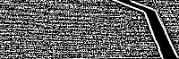
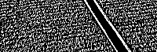
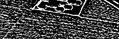
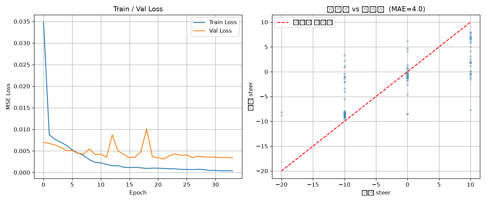

# 🚗 자율주행 RC카 (차동 구동) 학습 및 주행 프로젝트 요약

본 문서는 조향 장치가 없는 4WD 차동 구동(Differential Drive) 기반의 RC카를 인공지능(PyTorch) 자율주행으로 제어하기 위해 사용한 하드웨어 환경과 주행 학습 데이터를 수집하는 과정을 정리한 기술 문서입니다.

---

## 1. 사용한 하드웨어

| 구분 | 사양 및 부품명 | 역할 및 특징 |
| :--- | :--- | :--- |
| **메인 프로세서** | 라즈베리 파이 4 (Raspberry Pi 4) | 카메라 영상 실시간 캡처, AI 모델 추론, 하위 제어기에 명령 전송 |
| **하위 제어기** | STM32F103RB | 라즈베리파이의 명령 수신 및 모터 PWM 신호 제어 수행 |
| **영상 입력장치** | USB 카메라 (화각 60도) | 트랙의 전방 영상을 촬영하여 라즈베리파이로 전달 |
| **주행 플랫폼** | 4WD RC 카 (차동 구동 방식) | 물리적인 조향 장치(서보모터) 없이 양쪽 바퀴의 속도차를 이용해 방향 전환 |
| **입력 장치** | 수동 리모컨 | 인공지능 학습을 위한 초기 주행 데이터(정답) 수집 시 조향 조작 |

---

## 2. 학습데이터 얻기

인공지능 모델이 스스로 운전하는 법을 배우기 위해서는 **전방 영상(문제)** 과 그 상황에 맞는 **조향 수치(정답)** 가 하나로 묶인 원본 데이터셋을 수집해야 합니다.

### 2.1 주행 영상과 로그 파일 수집 과정

| 수집 단계 | 세부 작업 내용 | 동작 원리 및 설명 |
| :---: | :--- | :--- |
| **1. 주행 조작** | 정해진 트랙을 수동 주행 | 차량의 전진 **속도는 상수로 고정**한 상태에서, 개발자가 리모컨을 이용해 트랙을 따라 좌/우 조향만을 컨트롤하며 주행합니다. |
| **2. 영상 촬영** | 실시간 프레임 이미지 저장 | 주행을 하는 동안 USB 웹캠이 전방 영상을 연속으로 촬영하여 라즈베리파이에 개별 사진 파일로 저장합니다. |
| **3. 로그 기록** | `driving_log.csv` 파일 작성 | 이미지가 찍히는 바로 그 순간의 **①사진 파일명**과 **②리모컨 조향 지시값(`steer`)** 을 엑셀 파일(CSV)의 한 줄에 나란히 기록합니다. |
| **4. AI 정답지화** | 문제-정답 매핑 | "특정 형태의 커브길 사진" = "리모컨을 -20만큼 꺾었다"라는 매칭 쌍이 완성되어 모델의 훌륭한 원본 데이터(정답지)가 됩니다. |

### 2.2 조향 알고리즘 (데이터 수집 시 차동 구동 제어)

RC카에 물리적인 조향 각도(Angle)를 만드는 서보모터(Steering Wheel)가 없기 때문에, 주행 데이터를 얻기 위해 리모컨으로 `steer`(방향 지시값)를 입력하면 STM32에서는 좌/우 양쪽 바퀴의 회전 속도를 다르게 주는 **차동 구동(Differential Steering)** 방식으로 방향 전환을 수행했습니다.

> **💡 차동 조향 핵심 원리**: 회전하려는 쪽의 안쪽 바퀴를 멈추는 것을 넘어 **역회전**시키고, 바깥쪽 바퀴는 **가속**시켜 제자리 팽이처럼 날카롭고 빠른 회전력을 만들어 냅니다. (`가중치 3배` 적용)

| 주행 상태 | 바퀴 동작 원리 | 왼쪽 바퀴 제어 수식 | 오른쪽 바퀴 제어 수식 |
| :---: | :--- | :--- | :--- |
| **직진**  `steer == 0` | 양쪽 바퀴가 동일한 기본 속도로 전진 | `left = speed` | `right = speed` |
| **좌회전**  `steer > 0` | **왼쪽(안쪽)** 역회전  **오른쪽(바깥)** 가속 | `left = -steer * 3` | `right = speed + steer * 3` |
| **우회전**  `steer < 0` | **왼쪽(바깥)** 가속  **오른쪽(안쪽)** 역회전 | `left = speed - steer * 3` | `right = steer * 3` |

*(※ 위 수식을 통해 계산된 left, right 값은 -100 ~ 100 범위로 제한(Clamp)된 후 모터 구동 핀으로 출력됩니다.)*

---

## 3. 학습데이터 가공

촬영된 원본 컬러 영상을 AI 모델(PilotNet)에 그대로 넣으면 불필요한 배경 정보와 빛 반사 때문에 학습 효율이 크게 떨어집니다. 따라서 AI가 '트랙 선'이라는 핵심 정보만 학습할 수 있도록 OpenCV를 이용해 데이터를 가공(전처리)합니다.

### 3.1 OpenCV를 이용한 영상 보정 (전처리) 과정

| 보정 순서 | 적용 기법 (함수) | 수행 작업 | 해당 보정을 적용한 명확한 이유 |
| :---: | :--- | :--- | :--- |
| **1. 자르기** | 자르기 (`crop`) | 상단 45% 이미지 잘라내기 | 자율주행과 무관한 배경(천장, 벽, 하늘 등)을 날려버리고, 주행에 필요한 **바닥의 트랙 부분만 남기기 위함**입니다. |
| **2. 흑백 변환** | Grayscale (`cvtColor`) | 컬러(BGR) ➔ 흑백 변환 | 차선을 인식하는데 컬러 데이터는 불필요하므로, **연산량을 줄이고 트랙의 형태에 집중**하기 위함입니다. |
| **3. 대비 강화** | CLAHE (`createCLAHE`) | 영상 구역별 명암 대비 극대화 | 조명이나 그림자가 고르지 않은 환경에서도 **어두운 트랙과 밝은 바닥의 경계를 뚜렷하게 분리**해내기 위함입니다. |
| **4. 노이즈 제거**| 가우시안 블러 (`GaussianBlur`) | 부드러운 흐림 효과 적용 | 자잘한 픽셀 노이즈나 먼지 등을 뭉개서, 다음 단계(이진화)에서 **엉뚱한 점이 차선으로 인식되는 오류를 방지**합니다. |
| **5. 적응형 이진화**| Adaptive Threshold | 흑백 픽셀 반전 분리 (0 또는 255) | 주변 밝기에 적응하여 **어두운 트랙 선은 하얗게(255), 밝은 바닥은 검게(0) 완전 분리**하여 AI가 학습할 핵심 특징만 남깁니다. |
| **6. 크기 조절** | Resize (`resize`) | 200 x 66 픽셀로 이미지 압축 | 엔비디아(NVIDIA) **PilotNet 모델이 요구하는 정확한 입력 규격**에 맞추어 이미지를 작고 가볍게 만듭니다. |

  
---
## 4. 파이토치(PyTorch) 인공지능 모델 학습 과정

수집되고 가공된 데이터는 마침내 파이토치(PyTorch) 프레임워크를 통해 실제 자율주행 능력을 갖춘 인공지능으로 거듭납니다.

### 4.1 정답(Steer) 데이터의 정규화 (Normalization)
로그 파일에 기록된 원본 조향 지시값(steer) 데이터는 -100에서 100 사이의 숫자로 이루어져 있습니다. (예: 직진=0, 우회전=-100). 신경망 모델이 이를 더 빠르고 정확하게 학습할 수 있도록, **100.0(`STEER_SCALE`)으로 나누어 -1.0 ~ 1.0 사이의 소수로 변환(정규화)** 하여 모델의 정답지로 제공했습니다.
* 예: 좌회전 지시 `steer = 25` ➔ 학습 데이터 `0.25`
* 예: 우회전 지시 `steer = -100` ➔ 학습 데이터 `-1.0`

### 4.2 모델 학습 알고리즘 요약

| 학습 과정 | 적용된 기법 및 역할 | 상세 설명 |
| :---: | :--- | :--- |
| **1. 데이터 입력** | `DataLoader` | - 전처리된 `200x66` 흑백 이미지(문제)와 `-1.0 ~ 1.0`으로 정규화된 조향 지시값(정답)이 묶여 파이토치 모델에 배치(Batch) 단위로 들어갑니다. |
| **2. 모델 연산** | `PilotNet` (CNN 아키텍처) | - 자율주행 특화 딥러닝 구조인 **PilotNet** (NVIDIA 논문 기반)을 커스텀하여 사용했습니다.  - 5개의 컨볼루션(특징 추출) 층과 4개의 선형(판단) 층이 연쇄적으로 작용해 복잡한 차선 패턴을 인식합니다. |
| **3. 최적화 및 평가** | `MSELoss` & `Adam` Optimizer | - **MSE Loss(평균 제곱 오차)**: AI가 찍은 조향 정답과 사람이 실제로 조종했던 조향값의 차이(오차)를 수학적으로 계산합니다.  - **Adam Optimizer**: 그 오차를 가장 빠르고 똑똑하게 줄일 수 있는 방향으로 모델의 뇌(가중치)를 학습시킵니다. |
| **4. 과적합 방지** | `ReduceLROnPlateau` &  조기 종료(Early Stopping) | - 학습이 정체되어 오차가 안 줄어들 때, **학습률(Learning Rate)을 절반(0.5배)으로 줄여가며 미세 조정**을 수행합니다.  - 60 에폭(Epoch)을 무의미하게 다 돌리지 않고, **12번 이상 개선이 없으면 과적합으로 판단해 학습을 즉시 강제 종료**합니다. (이때 역대 최고 성적을 낸 가중치만 `best_model.pt`로 저장) |

### 4.3 모델 학습 성능 평가 결과물 (시각화 분석)
학습이 끝난 후 `evaluate.py` 분석 스크립트를 통해 모델의 성능을 직접 시각화하여 확인하셨던 원본 종합 평가 결과물입니다.

**모델 종합 평가 결과 (Loss 및 정확도)**
좌측의 **Train/Val Loss 그래프**를 보면 파란색 선(훈련 오차)과 주황색 선(실전 오차)이 모두 급격하게 떨어지며 거의 0에 수렴하는 안정적인 학습 곡선을 보여줍니다. 
우측의 **정답 vs 예측값 산점도(Scatter)** 에서는 빨간 점선(완벽한 정답 선) 주변에 파란색 점들이 오밀조밀하게 모여 있어, 물리적 조향 장치가 없는 차동 구동의 추상적인 `steer` 제어값임에도 불구하고 AI가 인간의 리모컨 조작 패턴을 거의 완벽하게(평균 오차 MAE=4.0) 복제하여 학습했음을 증명합니다.

---

## 5. 프로젝트 최종 결과 및 결론 (Lessons Learned)

학습된 모델을 RC카에 탑재하여 실제 트랙에서 자율주행 테스트를 진행한 결과, 다음과 같은 중요한 성과와 한계점을 얻을 수 있었습니다.

* **주행 결과 (Result)**
  > - **상황 인지**: 사용된 웹캠의 **화각이 60도로 매우 좁아** 주변 시야가 제한됨에 따라, 초기에 수집된 학습용 영상 데이터의 질 자체가 상당히 떨어지는 불리한 조건이었습니다.
  > - **최종 성과**: 그럼에도 불구하고, 직선 코스 4군데와 90도 회전 구간 2군데로 구성된 전체 주행 경로 중 **약 50%의 구간을 성공적으로 자율주행**해 내는 유의미한 성과를 거두었습니다.

* **최종 결론 (Conclusion)**
  > - 좁은 화각으로 인해 급커브에서 차선을 놓치는 현상을 통해, 인공지능 자율주행에 있어서 모델의 성능만큼이나 **'양질의 넓은 시야를 가진 학습 데이터 확보가 매우 중요하다'**는 핵심적인 교훈을 얻게 되었습니다.

---

## 🎥 관련 영상 (YouTube)
* **학습용 주행 영상**: [https://youtu.be/7M5P6-Q6pJk](https://youtu.be/7M5P6-Q6pJk)
* **자율주행 테스트 영상**: [https://youtu.be/o-jBJ83kxJ8](https://youtu.be/o-jBJ83kxJ8)
